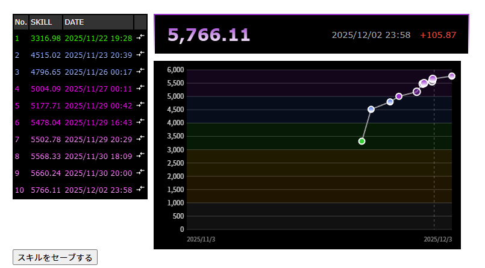
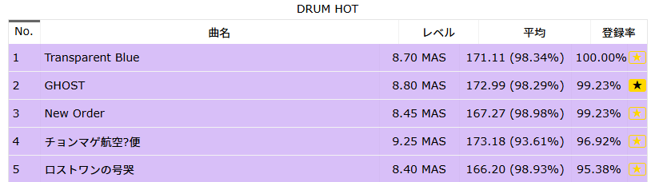

# GSV Extension

GITADORA Skill Viewer ([gsv.fun](gsv.fun)) の機能を拡張するChrome拡張機能です。
※非公式

## 機能

### 1. スキル履歴グラフ表示
プレイヤーページのスキル履歴テーブルの横に、スキル推移のグラフを表示します。


### 2. お気に入り登録ボタン
稼ぎ曲ページ（/kasegi/）の各曲の右側に★ボタンを追加します。
★ボタンをクリックするとGITADORA公式サイトのお気に入り曲登録ページに飛びますので手動で楽曲を登録してください。



## インストール

1. このリポジトリをクローンまたはダウンロード
2. Chromeで `chrome://extensions/` を開く
3. 「デベロッパーモード」を有効にする
4. 「パッケージ化されていない拡張機能を読み込む」をクリック
5. ダウンロードしたフォルダを選択

## 初期設定（お気に入りボタン機能を使う場合）

お気に入りボタン機能を使用するには、最初に曲マッピングを生成する必要があります。

1. [p.eagate.573.jp](https://p.eagate.573.jp)にログインする
2. 拡張機能のアイコンをクリックし「マッピング生成」ボタンをクリック
3. 約1分で全曲のスキャンが完了し、マッピングが保存される

※ 持っていない曲はスキャン対象にならないため楽曲を解禁したら、同じ手順で再生成してください。

## 対応サイト

- https://gsv.fun/* - スキルグラフ、お気に入りボタン
- https://p.eagate.573.jp/game/gfdm/*/p/setting/* - 自動スクロール＆ハイライト、マッピング生成

## ファイル構成

```
GSV/
├── manifest.json       # 拡張機能の設定
├── content.js          # gsv.fun用スクリプト
├── content_573.js      # 573.jp用スクリプト
└── README.md
```
